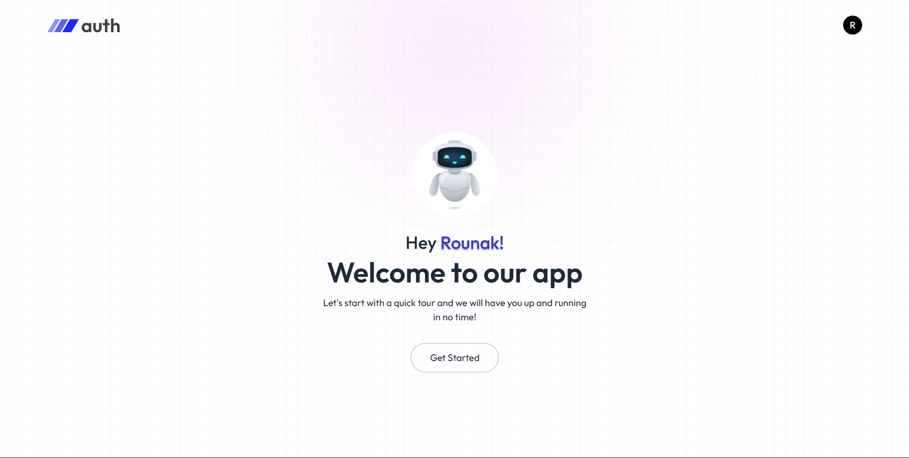
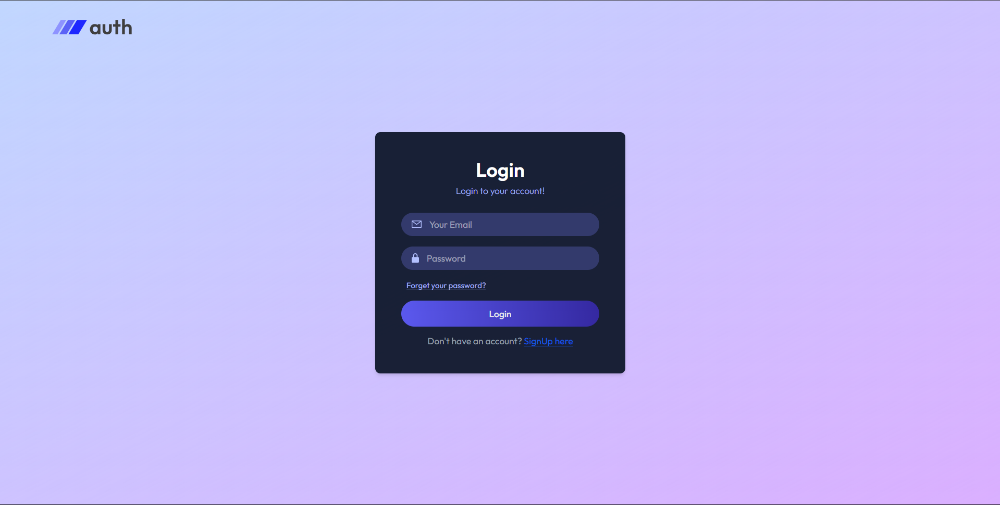
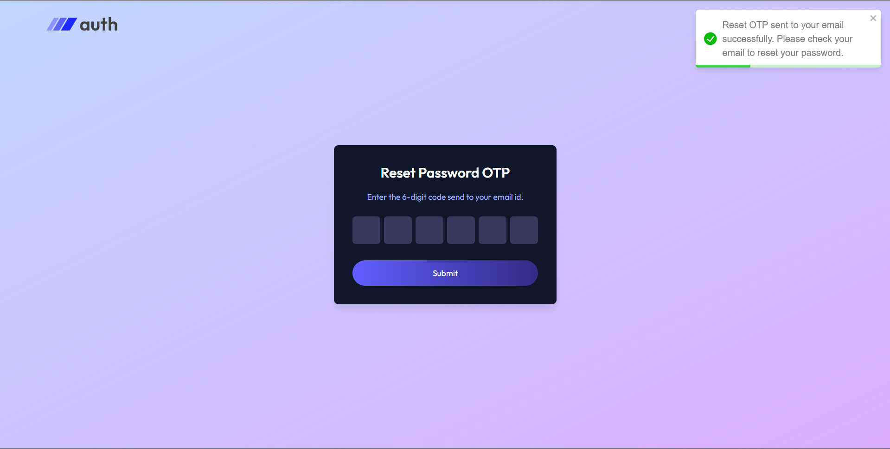

# 🛡️ Account Verification App

A full-stack authentication system built with **MongoDB, Express, React, and Node.js**, featuring:
- Email verification via OTP
- Password reset functionality
- JWT-based authentication
- Secure cookie handling
---

## ✨ Features
- ✅ User registration with email verification
- 🔐 Login & protected routes using JWT tokens
- 📩 Send OTP via email using `nodemailer`
- 🔁 Password reset via verified OTP
- ☁️ Environment-variable driven secure setup
---

## 📸 Screenshots

### 🧾 Register & Verify Email


### 🔑 Login


### 🔁 Reset Password with OTP



## 🧪 Tech Stack

| Layer         | Technology                  |
|---------------|------------------------------|
| Backend       | Node.js, Express.js         |
| Database      | MongoDB (Mongoose)          |
| Email Service | Nodemailer (SMTP)           |
| Auth          | bcrypt, JWT                 |
| Environment   | dotenv                      |

---


---

## 🚀 Getting Started
### 1. Clone the repo

```bash
git clone https://github.com/rou-nak-cloud/Account-Verification.git
npm install
npm run dev

cd Account-Verification

cd server
npm install

cd ../client
npm install
```

```
Environments:

PORT=5000
MONGODB_URI=your_mongodb_connection_string
JWT_SECRET=your_jwt_secret
SMTP_HOST=smtp.example.com
SMTP_PORT=587
SMTP_USER=your_email@example.com
SMTP_PASSWORD=your_email_password
SENDER_EMAIL=your_email@example.com
```

##🔐 Security Measures

- **Password Hashing using bcrypt**
- **JWT Tokens for secure auth**
- **httpOnly Cookies for protection**
- **OTP Expiry set for 10 minutes**
- **Input validation and proper error handling**

## Author
-- *Rounak Bakshi*
--*Project: Account Verification Repo*
